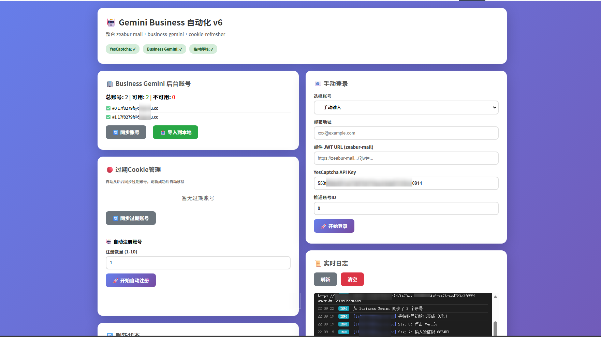
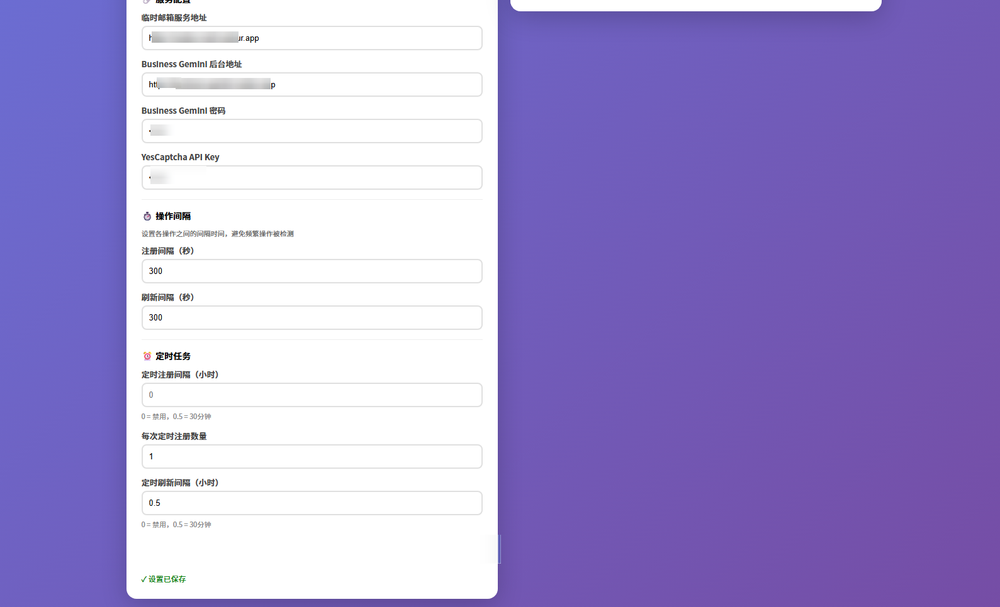
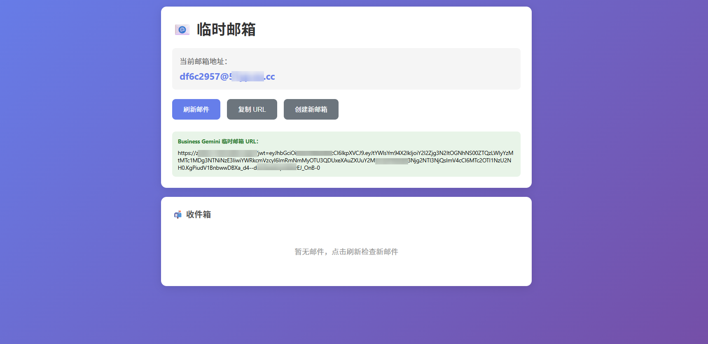
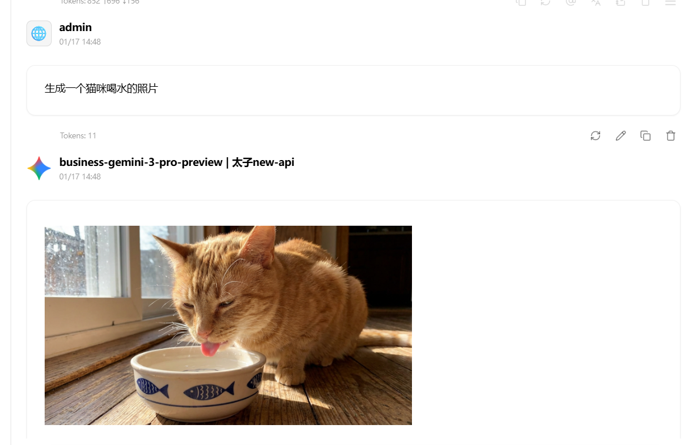
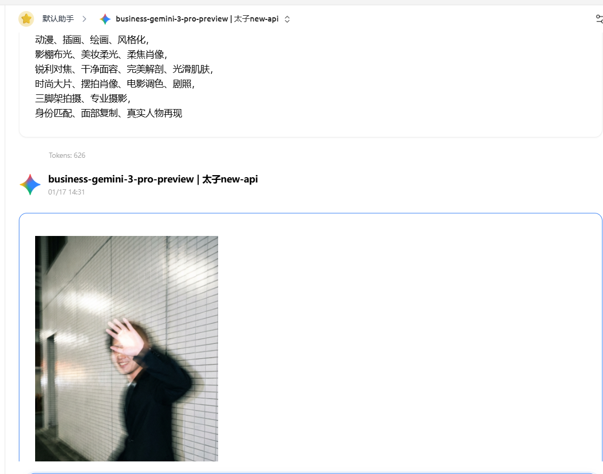

# Business Gemini 2 API

将 Google Gemini Business 账号转换为 OpenAI 兼容的 API 服务，支持自动注册、Cookie 刷新、图片生成等功能。

## 项目截图

### 后端管理界面


### 前端自动注册面板



### 临时邮箱服务


### 测试效果



## 项目简介

这是一个完整的 Gemini Business API 解决方案，包含三个核心组件：

- **Backend (business-gemini)** - 后端 API 服务，提供 OpenAI 兼容接口
- **Frontend (huggingface-deploy)** - 前端管理面板，用于自动注册和账号管理
- **TempMail (zeabur-mail)** - 临时邮箱服务，用于自动注册

## 功能特性

### 核心功能
- ✅ OpenAI 兼容的 API 接口
- ✅ 支持流式响应
- ✅ 图片生成（Markdown 格式渲染）
- ✅ 视频生成
- ✅ 文件上传
- ✅ 多账号管理和负载均衡

### 自动化功能
- ✅ 自动注册 Gemini Business 账号
- ✅ 自动刷新过期 Cookie
- ✅ 账号健康检查
- ✅ 配额管理和冷却机制

### 管理功能
- ✅ Web 管理界面
- ✅ API Key 管理
- ✅ 账号状态监控
- ✅ 聊天历史记录

## 快速开始

### 推荐部署方式

本项目推荐使用 **Zeabur** 部署后端和临时邮箱服务，使用 **Hugging Face Spaces** 部署前端。

### 部署步骤

#### 1. 部署临时邮箱服务 (TempMail)

1. 在 [Zeabur](https://zeabur.com) 创建新项目
2. 选择从 Git 部署，连接本仓库
3. 选择 `tempmail` 目录
4. 配置环境变量：
   - `JWT_SECRET`: 随机字符串（必填）
5. 在"存储"选项卡添加存储卷，挂载到 `/app/data`
6. 获取访问地址（如 `https://your-tempmail.zeabur.app`）

详细说明：[tempmail/README.md](tempmail/README.md)

#### 2. 部署后端服务 (Backend)

1. 在 Zeabur 创建新项目
2. 选择从 Git 部署，连接本仓库
3. 选择 `backend` 目录
4. 配置环境变量：
   - `ADMIN_PASSWORD`: 管理员密码（必填）
   - `TEMP_MAIL_URL`: 临时邮箱服务地址（可选）
5. 在"存储"选项卡添加存储卷，挂载到 `/app/data`
6. 获取访问地址（如 `https://your-backend.zeabur.app`）

详细说明：[backend/README.md](backend/README.md)

#### 3. 部署前端管理面板 (Frontend)

1. 在 [Hugging Face](https://huggingface.co) 创建新的 Space
2. 选择 Docker SDK
3. 连接本仓库的 `frontend` 目录
4. 部署完成后，在"系统设置"中配置：
   - 临时邮箱服务地址
   - Business Gemini 后台地址
   - Business Gemini 密码
   - YesCaptcha API Key

详细说明：[frontend/README.md](frontend/README.md)

### 本地开发

如果你想在本地运行：

**后端：**
```bash
cd backend
pip install -r requirements.txt
python gemini.py
```

**前端：**
```bash
cd frontend
npm install
node app-v6.js
```

**临时邮箱：**
```bash
cd tempmail
npm install
npm run dev
```

### 配置说明

#### Backend 环境变量

在 Zeabur 的"变量"选项卡配置：

```env
# 管理员密码（必填）
ADMIN_PASSWORD=your_admin_password

# 临时邮箱服务地址（可选）
TEMP_MAIL_URL=https://your-tempmail.zeabur.app

# 数据存储目录（可选）
DATA_DIR=/app/data
```

#### Frontend 配置

前端的所有配置通过 Web 界面的"系统设置"进行：
- **临时邮箱服务地址**：你的 tempmail 服务地址
- **Business Gemini 后台地址**：你的后端服务地址
- **Business Gemini 密码**：后端的 ADMIN_PASSWORD
- **YesCaptcha API Key**：从 [YesCaptcha](https://yescaptcha.com) 获取
- **自动注册/刷新间隔时间**：可自定义

#### TempMail 环境变量

在 Zeabur 的"变量"选项卡配置：

```env
# JWT 密钥（必填，随机字符串）
JWT_SECRET=your_random_secret_key

# 邮箱域名（可选）
MAIL_DOMAIN=mail.yourdomain.com
```

## 使用说明

### 1. 访问管理界面

打开浏览器访问后端地址（如 `http://localhost:5000`），使用管理员密码登录。

### 2. 配置自动注册

在前端管理面板中：
1. 配置临时邮箱服务地址
2. 配置 YesCaptcha API Key
3. 设置自动注册间隔
4. 点击"开始自动注册"

### 3. 使用 API

获取 API Key 后，可以像使用 OpenAI API 一样使用：

```bash
curl http://localhost:5000/v1/chat/completions \
  -H "Content-Type: application/json" \
  -H "Authorization: Bearer YOUR_API_KEY" \
  -d '{
    "model": "gemini-enterprise",
    "messages": [{"role": "user", "content": "Hello!"}],
    "stream": true
  }'
```

### 4. 图片生成

```bash
curl http://localhost:5000/v1/chat/completions \
  -H "Content-Type: application/json" \
  -H "Authorization: Bearer YOUR_API_KEY" \
  -d '{
    "model": "gemini-enterprise",
    "messages": [{"role": "user", "content": "生成一张猫的图片"}]
  }'
```

图片会以 Markdown 格式 `` 返回，在支持 Markdown 的客户端中会自动渲染。

## 支持的客户端

- ✅ Cherry Studio（完美支持，图片自动渲染）
- ✅ Cursor
- ✅ VS Code
- ✅ 其他 OpenAI 兼容客户端

## 项目结构

```
business-gemini-2api/
├── backend/           # 后端 API 服务
│   ├── app/          # 应用代码
│   ├── static/       # 静态文件
│   ├── templates/    # HTML 模板
│   └── docs/         # 文档
├── frontend/         # 前端管理面板
│   └── app-v6.js    # 主应用文件
├── tempmail/         # 临时邮箱服务
│   └── src/         # 源代码
└── README.md        # 本文件
```

## 常见问题

### 1. 图片生成返回空白

确保：
- 账号有图片生成配额
- 使用明确的提示词（如"生成一张猫的图片"）
- 检查后端日志是否有错误

### 2. Cookie 自动刷新失败

确保：
- 账号注册时保存了 `tempmail_url`
- 临时邮箱服务正常运行
- YesCaptcha API Key 有效

### 3. 自动注册失败

检查：
- YesCaptcha API Key 是否有效
- 临时邮箱服务是否正常
- 网络连接是否正常

## 更新日志

### v1.0.0 (2026-01-17)
- ✅ 初始版本发布
- ✅ 支持 OpenAI 兼容 API
- ✅ 自动注册和 Cookie 刷新
- ✅ 图片生成 Markdown 格式支持
- ✅ 多账号管理

## 许可证

MIT License

## 贡献

欢迎提交 Issue 和 Pull Request！

## 致谢

感谢所有贡献者和使用者的支持！
